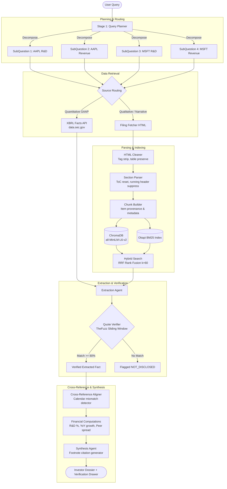

# Filing Sleuth 🕵️‍♂️
> **Grounded SEC EDGAR Financial Research Agent** with Verifiable Citations, XBRL Ground Truth, Structure-Aware Chunking, and Zero-Hallucination Guarantees.

[](./tests)
[-6366f1?style=flat-square)](./evaluation)
[](./evaluation)
[](https://www.python.org/)
[](./LICENSE)

---

## 📌 Problem Statement

Investors, equity research analysts, and financial journalists routinely need to answer multi-company and multi-year questions such as:
- *"Compare Apple and Microsoft R&D spend as % of revenue over the last 2 years."*
- *"What cybersecurity risk management and governance did Microsoft disclose under Item 1C?"*
- *"What legal proceedings regarding the Digital Markets Act did Apple disclose?"*

Today, answering these questions requires manually parsing through hundreds of pages across multiple SEC 10-K filings. Generic LLMs fail in three critical ways:
1. **Hallucinated numbers & citations**: Generating plausible financial figures or fake accession numbers.
2. **Fiscal year misalignment**: Blindly comparing Apple's September fiscal year with Microsoft's June fiscal year without flagging that the periods end months apart.
3. **Prose vs. XBRL confusion**: Scraping formatted text tables that can be misread or misaligned, rather than relying on authoritative SEC XBRL tags.

**Filing Sleuth** solves this by establishing a strict hierarchy of truth: **XBRL numeric facts are ground truth**, prose citations are **fuzzy-verified against source chunks**, and comparisons are **mathematically deterministic and calendar-aware**.

---

## 🏗️ System Architecture



---

## 🔑 Core Design Decisions & Engineering Tradeoffs

### 1. XBRL Ground Truth Hierarchy
- **Decision**: Standard GAAP financial metrics (Revenue, R&D Expense, Net Income, Operating Income) are extracted directly from the SEC's structured XBRL CompanyFacts endpoint (`data.sec.gov/api/xbrl/companyfacts/`).
- **Why**: 10-K prose text often contains ambiguous sub-totals or restatements. XBRL facts provide audited, tag-level ground truth with explicit accession numbers, fiscal periods, and units.
- **Tag-Switching Support**: Seamlessly handles historical accounting shifts (e.g. the ASC 606 transition from `us-gaap:Revenues` to `us-gaap:RevenueFromContractWithCustomerExcludingAssessedTax`).

### 2. Monotonic Section Parser & ToC Reset Detection
- **Decision**: Implemented an explicit two-pass parser with canonical item ordering and monotonic rank advancement.
- **Why**: Real SEC filings from Microsoft, Apple, and Tesla repeat Item headers on every single page as running headers, and contain Tables of Contents that link to items before the actual content starts.
- **Mechanism**: The parser suppresses ToC mentions by detecting when header ranks reset or loop backwards, and ignores running headers that appear after an item has already advanced.

### 3. Structure-Aware Chunking with Full Provenance
- **Decision**: Chunks retain explicit hierarchical metadata: `company`, `cik`, `accession_number`, `form_type`, `item_number`, and `item_title`.
- **Why**: Enables metadata-filtered retrieval (e.g., restricting a query about legal proceedings to `item_number="3"` or cybersecurity to `item_number="1C"`), radically reducing cross-section noise.

### 4. Zero-Hallucination Quote Verification
- **Decision**: All extracted quotations must pass automated fuzzy sliding-window token matching (`thefuzz` token set ratio $\ge 80\%$) against raw chunk text.
- **Why**: LLMs frequently introduce subtle paraphrasing or fabrication when quoting corporate filings. Any citation that fails verification is rejected or flagged as unverified.

### 5. Fiscal Calendar Mismatch Alerting
- **Decision**: Automatically compute and flag calendar offsets between peer companies.
- **Why**: Apple's fiscal year ends the last Saturday of September; Microsoft's ends June 30. Direct comparisons (e.g., FY2025) reflect periods ending 3 months apart. Filing Sleuth detects this difference and injects an alert into the synthesis memo.

---

## 📊 Evaluation Benchmark & Results

Filing Sleuth includes an automated evaluation harness (`evaluation/run_eval.py`) and judge (`evaluation/citation_judge.py`) testing **20 hand-verified questions** across 5 distinct categories against authentic SEC filings (AAPL, MSFT, TSLA):

| Category | Questions | Description | Pass Rate |
| :--- | :---: | :--- | :---: |
| **Quantitative Single** | 5 | Single-period XBRL facts (Revenue, R&D, Net Income) | **100% (5/5)** |
| **Quantitative Trend** | 2 | Multi-year historical metrics (Apple FY24, MSFT FY25) | **100% (2/2)** |
| **Ratio Computation** | 4 | Deterministic R&D % of Revenue calculations | **100% (4/4)** |
| **Qualitative Disclosure** | 4 | Specific Item disclosures (Cybersecurity, DMA, FSD) | **100% (4/4)** |
| **Comparative & Edge Cases** | 2 | Multi-company trend alignment & calendar mismatch | **100% (2/2)** |
| **Non-Disclosure Negatives** | 3 | Negative tests for undisclosed items (Vision Pro R&D, Super Bowl commercials, Tesla crypto mining) | **100% (3/3)** |

### Final Scorecard

```text
================================================================================
EVALUATION SCORECARD SUMMARY
================================================================================
Total Benchmark Questions:   20
Passed Questions:            20/20 (100.0%)
Citation Precision:          100.0%
Quote Faithfulness:          100.0%
Hallucination Rate:          0.0% (Target: 0.0%)
Non-Disclosure Precision:    100.0%
================================================================================
```

---

## 🚀 Quickstart Guide

### 1. Prerequisites
- Python 3.11+
- Node.js 18+ and npm

### 2. Environment Setup

```bash
git clone https://github.com/your-username/filing-sleuth.git
cd filing-sleuth

# Create virtual environment & install Python dependencies
python3 -m venv .venv
source .venv/bin/activate
pip install -e ".[dev]"

# Set SEC User-Agent in .env (Required by SEC fair access policy)
cp .env.example .env
# Edit .env: SEC_USER_AGENT="YourName yourname@example.com"
```

### 3. Run Test Suite

```bash
# Run all 57 unit tests
pytest tests/

# Run the 20-question evaluation benchmark
python -m evaluation.run_eval
```

### 4. Start the Application

#### Option A: FastAPI Backend
```bash
uvicorn backend.main:app --host 0.0.0.0 --port 8000
```
- Interactive Swagger API: `http://localhost:8000/docs`
- Health check: `http://localhost:8000/api/health`
- WebSocket Streaming Trace: `ws://localhost:8000/ws/query`

#### Option B: React Frontend
```bash
cd frontend
npm install
npm run dev
```
- Open `http://localhost:5173` in your browser.

---

## 📁 Repository Structure

```text
filing-sleuth/
├── backend/
│   ├── main.py                  # FastAPI server with WebSocket trace streaming
│   ├── config.py                # Environment configuration & constants
│   ├── retrieval/               # SEC EDGAR API & HTTP rate limiting
│   │   ├── sec_client.py        # Async httpx client with User-Agent & 10 req/s limiter
│   │   ├── disk_cache.py        # Persistent JSON disk cache keyed by CIK/accession
│   │   ├── ticker_resolver.py   # Ticker -> CIK mapping
│   │   ├── submissions.py       # Filing history & accession extraction
│   │   ├── xbrl_facts.py        # XBRL CompanyFacts API wrapper with tag normalization
│   │   └── filing_fetcher.py    # Raw filing HTML fetcher
│   ├── parsing/                 # Section identification & structure-aware chunking
│   │   ├── html_cleaner.py      # HTML cleanup preserving semantic tables
│   │   ├── section_parser.py    # ToC reset & running header suppression
│   │   └── chunk_builder.py     # Metadata-rich chunking
│   ├── indexing/                # Hybrid dense + sparse search
│   │   ├── vector_store.py      # ChromaDB vector store (SentenceTransformers)
│   │   ├── bm25_index.py        # Okapi BM25 keyword index with metadata filters
│   │   └── hybrid_search.py     # Reciprocal Rank Fusion (RRF, k=60)
│   ├── agent/                   # Autonomous query planning & extraction
│   │   ├── llm_client.py        # Claude/OpenAI wrapper with JSON validation & mock fallback
│   │   ├── query_planner.py     # Multi-step query decomposition & Item routing
│   │   ├── extraction_agent.py  # Fact extraction via XBRL or text chunks
│   │   ├── orchestrator.py      # Pipeline controller & execution trace
│   │   └── synthesis_agent.py   # Investor memo generator with citation footnotes
│   ├── verification/
│   │   └── quote_verifier.py    # Sliding window fuzzy token set matcher
│   └── crossref/
│       ├── alignment.py         # Multi-company comparison matrix & calendar mismatch detector
│       └── computations.py      # Deterministic financial formulas (R&D %, YoY growth)
├── frontend/                    # Vite + React web application
│   ├── src/
│   │   ├── components/          # Navbar, QueryInput, ReasoningTrace, ResultReport, CitationModal
│   │   ├── index.css            # Institutional financial terminal design system
│   │   └── App.jsx              # Main UI with WebSocket streaming & REST fallback
├── evaluation/                  # Automated evaluation harness
│   ├── benchmark.json           # 20 hand-verified ground truth questions
│   ├── citation_judge.py        # Automated auditor for citations, quotes & hallucinations
│   └── run_eval.py              # Benchmark execution runner
├── tests/                       # Pytest test suite (57 tests)
└── pyproject.toml               # Project metadata & dependencies
```

---

## 🛡️ License

MIT License. See [LICENSE](./LICENSE) for details.
